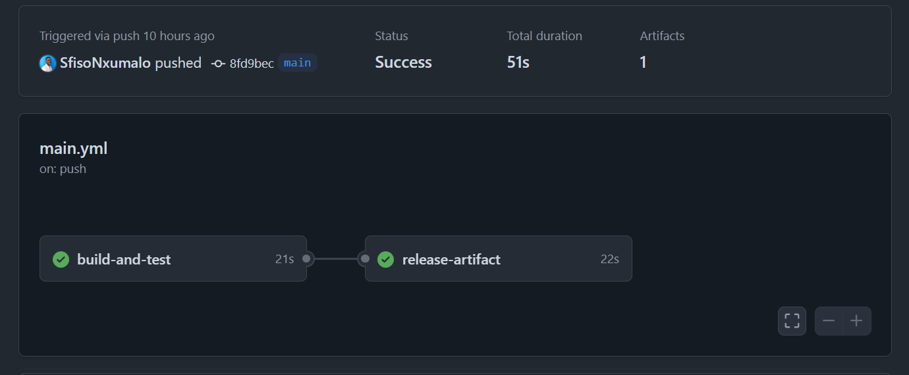

## API DOCUMENTATION
Overview
Created endpoint to handle the functionality of a user to register an employee.

**Endpoints created:**
- POST: `/api/Employee/AddEmployee`
- GET: `/api/Employee/GetAllEmplyee`
- GET: `/api/Employee/GetEmplyee/{EmployeeId}`
- DELETE: `/api/Employee/DeleteEmployee/{EmployeeId}`

#### Post (Add New Employee)
This endpoint `(/api/Employee/AddEmployee)` adds a new employee to the database.

###### Request body
`{
  "employeeId": 1,
  "fullName": "Sifiso",
  "email": "sfisomawila69@gmail.com",
  "name": "Sfiso"
}`

- employeeId - This refers to the new employee's Id. (N.B this will be also autogenerated in our database).
- fullName - This refers to the employee's name.
- email - This refers to the employee's email.

###### Response

This will return a message when a user is added successfully

#### Get (Get All Employees)
This endpoint `(/api/Employee/GetAllEmplyee)` gets all the employees saved in our database

###### Request body
NONE

###### Response

This will returns a list of employees

#### Delete (Delete an Employee)
This endpoint `(/api/Employee/DeleteEmployee/{EmployeeId})` deletes a user with the provided Employee ID 

###### Request body
NONE

###### Parameter
Employee ID

###### Response
This will return a message that the user with the provided Id has been deleted

### Changelog
- **[KP Water Management API Changelog](/Changelog.md)**