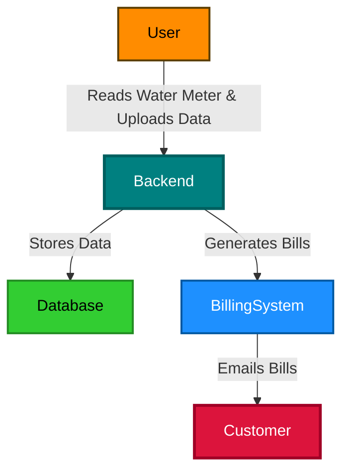
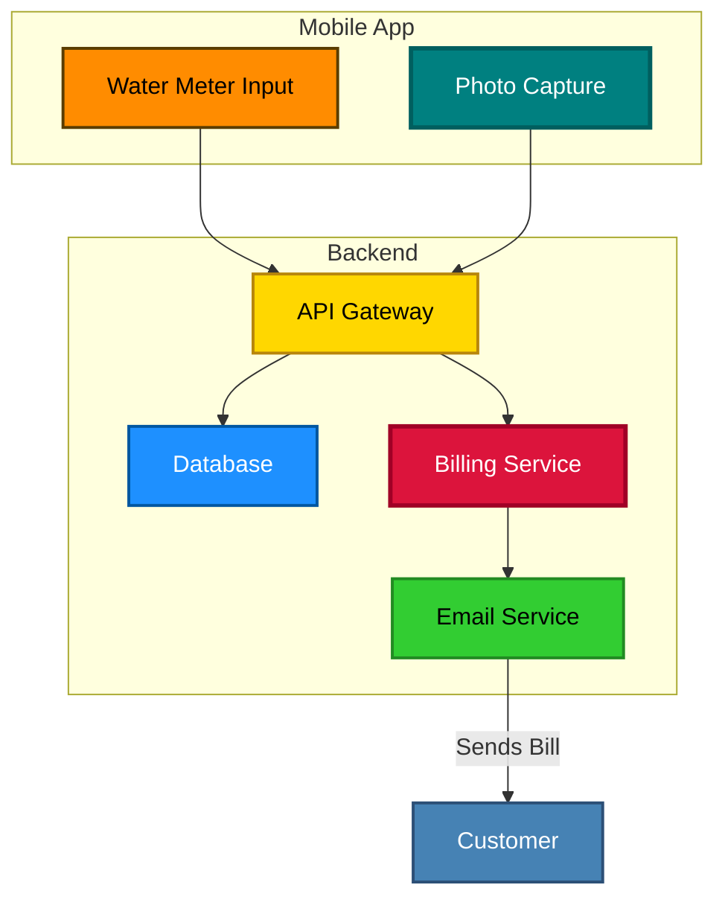

## Architecture Diagrams
### Context Diagram


### Container Diagram


# KP Water Billing System Architecture

## Overview
The **KP Water Billing System** is designed to digitize and automate water meter readings, storage, and billing. This document outlines the architecture of the system using C4 diagrams.

## C4 Model Diagram

```mermaid
C4Context
  title KP Water Billing System Context Diagram
  Person(employee, "Water Meter Reader", "Records water readings using the mobile app.")
  Person(customer, "Customer", "Receives water bills via email.")
  System(kp_system, "KP Water Billing System", "Automates water meter reading and billing process.")
  
  employee -> kp_system : Uploads water readings and images
  kp_system -> customer : Sends monthly water bill via email

C4Container
  title KP Water Billing System Container Diagram
  Person(employee, "Water Meter Reader", "Records water readings using the mobile app.")
  Person(customer, "Customer", "Receives water bills via email.")
  
  System_Boundary(kp_system, "KP Water Billing System") {
    Container(mobile_app, "Mobile App", "Flutter", "Allows employees to capture and upload water readings.")
    Container(backend, "Backend API", "Node.js & Express", "Handles business logic and database operations.")
    Container(database, "Database", "PostgreSQL", "Stores water meter readings and customer data.")
    Container(billing_service, "Billing Service", "Node.js", "Generates water bills based on recorded readings.")
    Container(email_service, "Email Service", "AWS SES", "Sends water bills to customers via email.")
  }
  
  employee -> mobile_app : Records meter reading
  mobile_app -> backend : Uploads data
  backend -> database : Stores data
  backend -> billing_service : Triggers billing process
  billing_service -> email_service : Sends bill notification
  email_service -> customer : Receives bill via email

