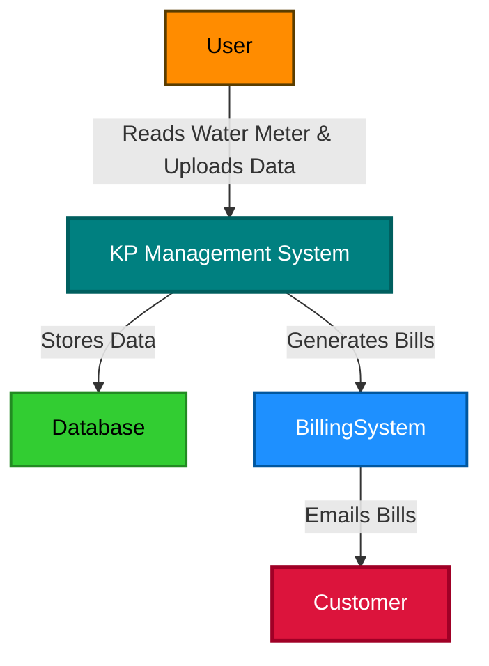
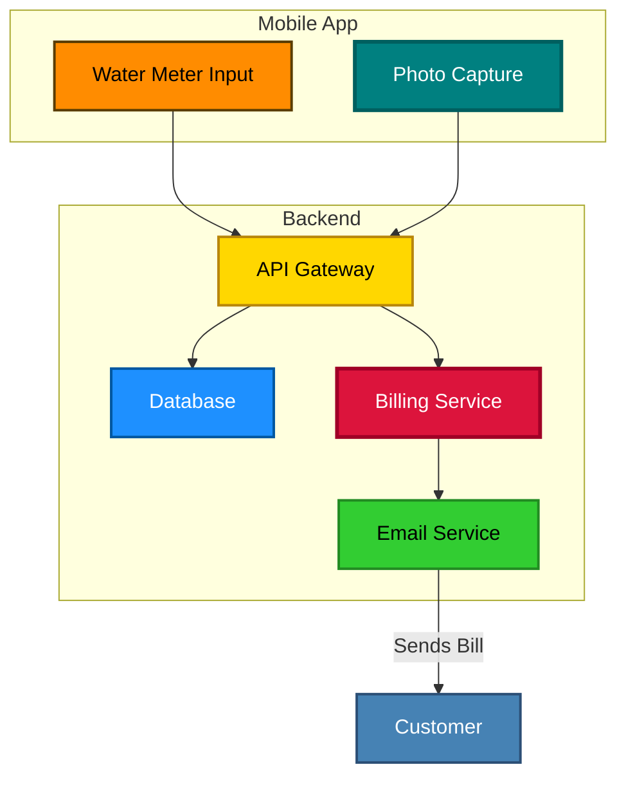

## Architecture Diagrams
### Context Diagram

```mermaid
graph TD;
    User -->|Reads Water Meter & Uploads Data| Backend
    Backend[KP Management System] -->|Stores Data| Database
    Backend -->|Generates Bills| BillingSystem
    BillingSystem -->|Emails Bills| Customer
    %% Apply Styles for Better Readability
  style User fill:#FF8C00,stroke:#5A3D00,stroke-width:2px,color:#000;
  style Backend fill:#008080,stroke:#005F5F,stroke-width:3px,color:#FFF;
  style BillingSystem fill:#1E90FF,stroke:#0057A0,stroke-width:2px,color:#FFF;
  style Customer fill:#DC143C,stroke:#A00026,stroke-width:3px,color:#FFF;
  style Database fill:#32CD32,stroke:#228B22,stroke-width:2px,color:#000;
```

### Container Diagram

```mermaid
graph TD;
    subgraph Mobile App
        A[Water Meter Input]
        B[Photo Capture]
    end
    subgraph Backend
        C[API Gateway]
        D[Database]
        E[Billing Service]
        F[Email Service]
    end
    A --> C
    B --> C
    C --> D
    C --> E
    E --> F
    F -->|Sends Bill| Customer

    %% Apply Styles for Better Readability
  style A fill:#FF8C00,stroke:#5A3D00,stroke-width:2px,color:#000;
  style B fill:#008080,stroke:#005F5F,stroke-width:3px,color:#FFF;
  style C fill:#FFD700,stroke:#B8860B,stroke-width:2px,color:#000;
  style D fill:#1E90FF,stroke:#0057A0,stroke-width:2px,color:#FFF;
  style E fill:#DC143C,stroke:#A00026,stroke-width:3px,color:#FFF;
  style F fill:#32CD32,stroke:#228B22,stroke-width:2px,color:#000;
  style Customer fill:#4682B4,stroke:#2C4F76,stroke-width:2px,color:#FFF;
```