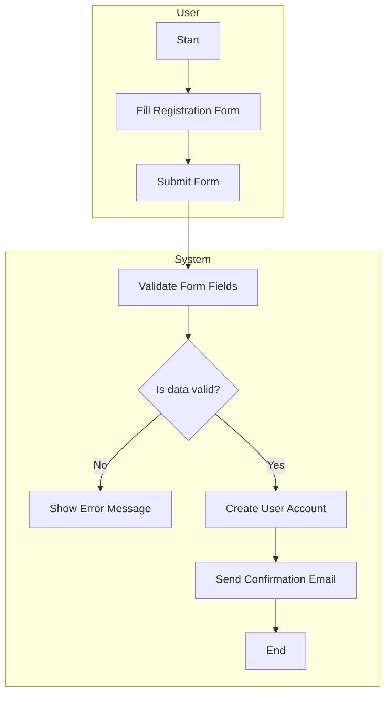
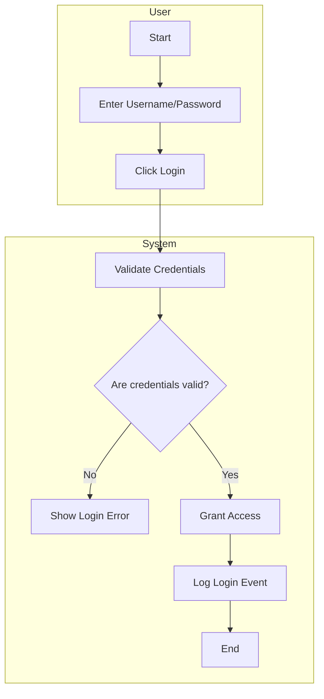
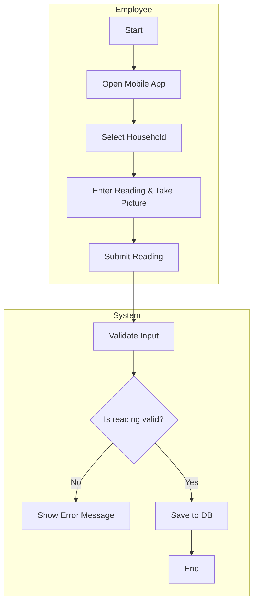
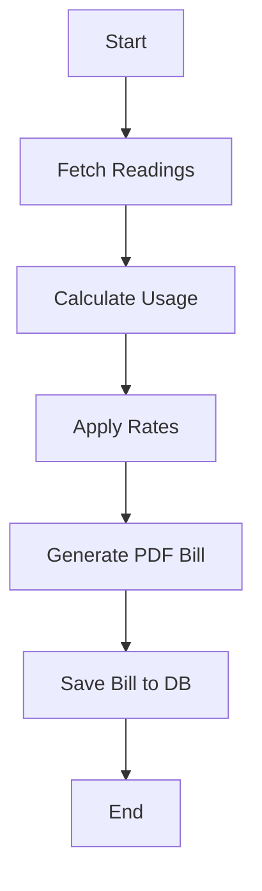
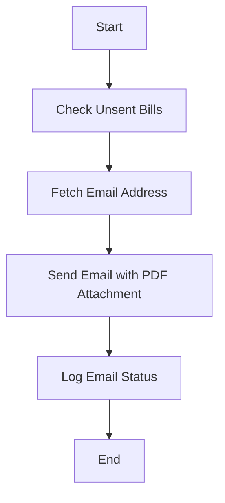
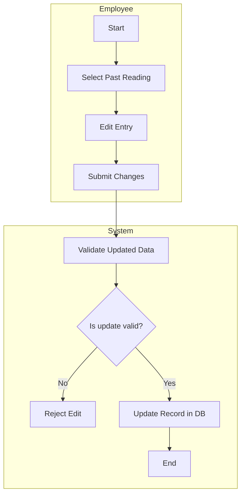
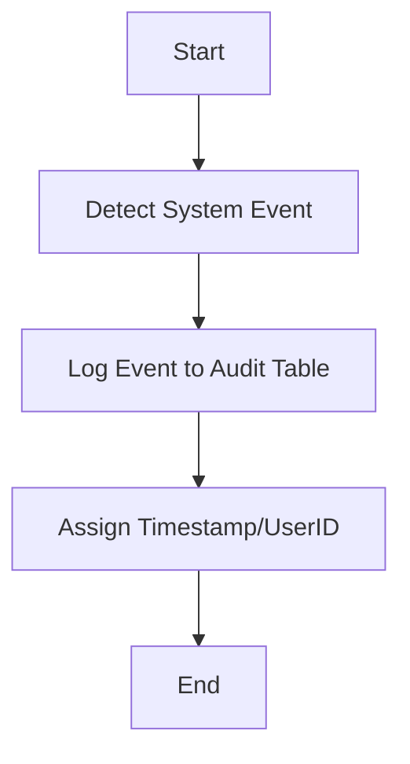
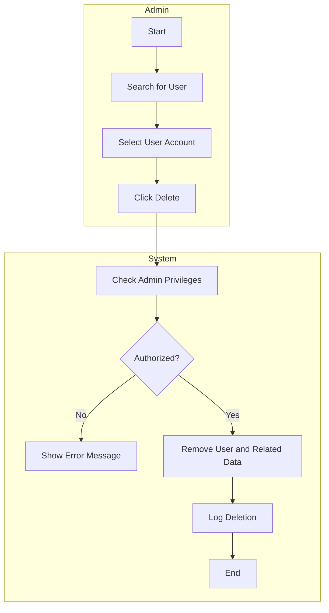

### Activity Workflow Modeling for KP Water Billing System

#### 1. **User Registration**

**Explanation:** This workflow ensures that only valid data is stored. It addresses usability and performance by validating before storage.

---

#### 2. **Login Process**

**Explanation:** This flow confirms secure access and helps with traceability (audit logs).

---

#### 3. **Capture Water Reading**

**Explanation:** Supports data accuracy, aligns with FR for reading capture.

---

#### 4. **Generate Monthly Bill**

**Explanation:** This batch job automates billing, improves performance and scalability.

---

#### 5. **Email Bill to Client**

**Explanation:** Meets stakeholder concern for paperless and timely billing.

---

#### 6. **Edit Water Reading**

**Explanation:** Supports maintainability and error correction.

---

#### 7. **System Audit Log Recording**

**Explanation:** Addresses security, maintainability and traceability.

---

#### 8. **Delete User Account (Admin Only)**

**Explanation:** Enforces secure user management, satisfies stakeholder security needs.
