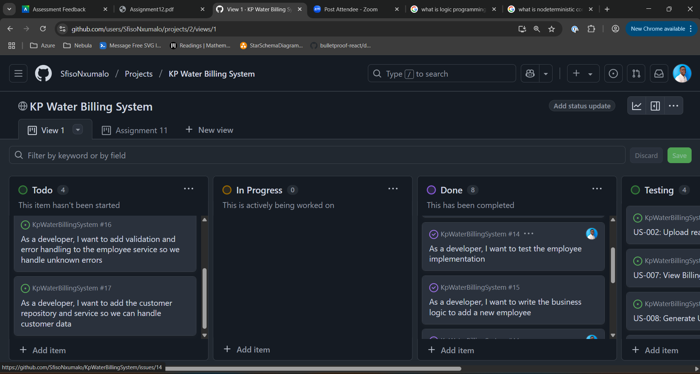

# Changelog

### Overview
The current KP Water Billing Management System API provides core CRUD functionality to manage employee data through a UserService that interacts with a generic StorageService<Employee>. Key features include endpoints for saving, retrieving (by ID or all), and deleting employee records. Recent improvements focused on ensuring proper service delegation through unit tests using NUnit and Moq. These tests verify that UserService correctly calls the underlying repository methods, improving code reliability and test coverage. Minor refinements were also made to standardize the Employee entity structure and support robust data handling.

- Closed user stories
- Fixed the way user stories are titled after software engineering class
- Moved tickets to testing. 