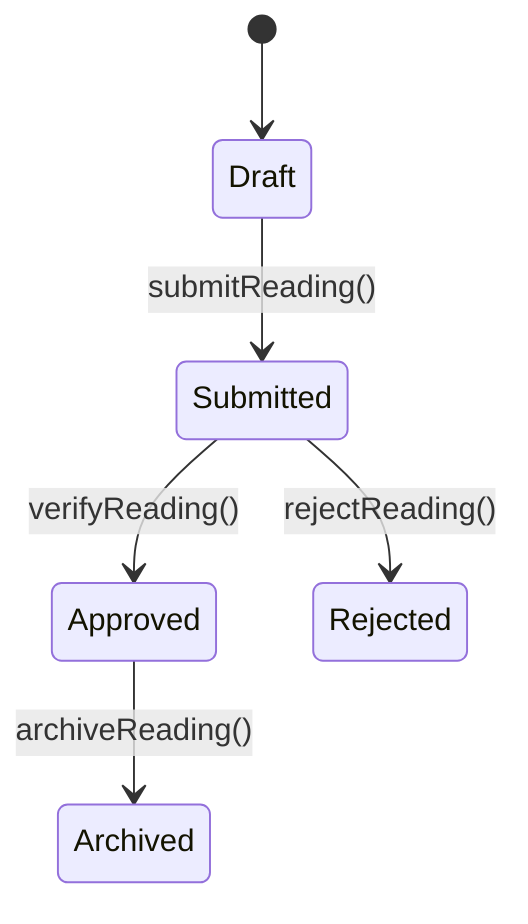
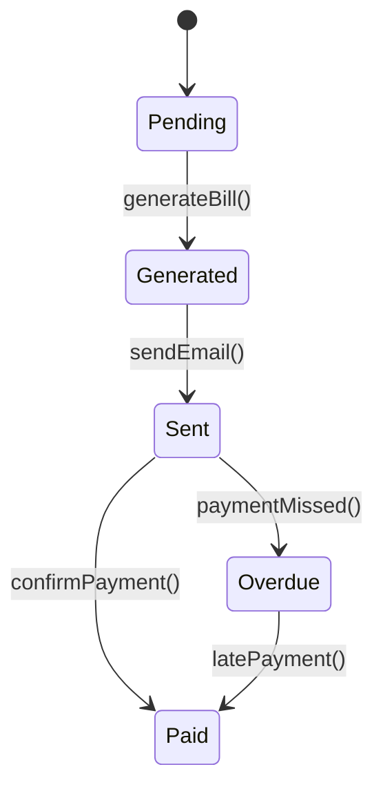
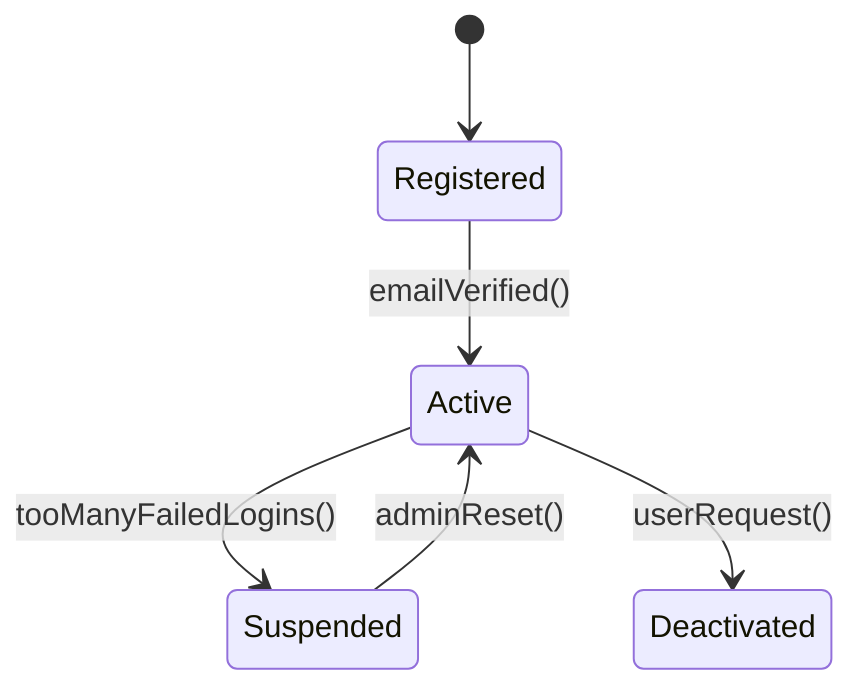
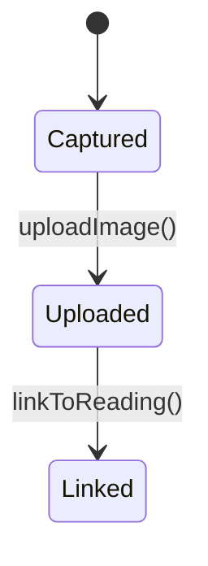
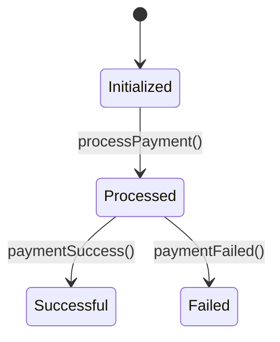
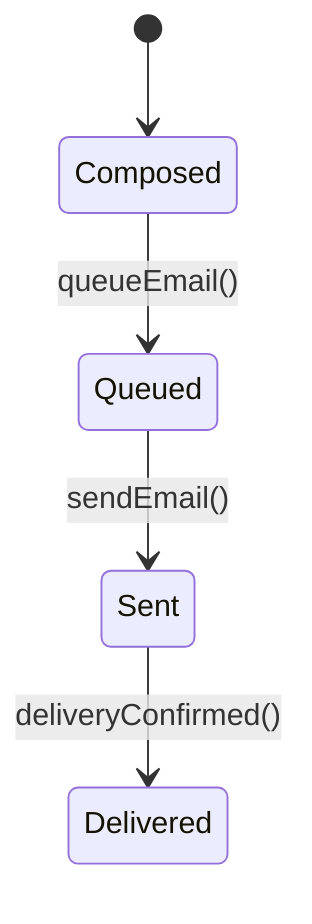
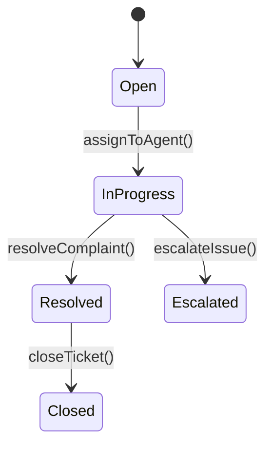

## Object State Modeling for KP Water Billing System

### 1. **WaterReading**

**Explanation:**
- **States**: Draft, Submitted, Approved, Rejected, Archived
- **Transitions**: Water readings start as Drafts, become Submitted, then either Approved or Rejected. Approved readings are archived for historical reference.
- **Functional Requirement Alignment**: Matches FR-002: Allow employees to record and submit readings.

### 2. **Bill**

**Explanation:**
- **States**: Pending, Generated, Sent, Paid, Overdue
- **Functional Requirement Alignment**: Aligns with FR-005: Automatically generate and send bills.

### 3. **UserAccount**

**Explanation:**
- **States**: Registered, Active, Suspended, Deactivated
- **Functional Requirement Alignment**: Supports security needs and login management.

### 4. **ReadingImage**

**Explanation:**
- **States**: Captured, Uploaded, Linked
- **Functional Requirement Alignment**: Tied to FR-003: Upload image as proof of water reading.

### 5. **Payment**

**Explanation:**
- **States**: Initialized, Processed, Successful, Failed
- **Functional Requirement Alignment**: Related to confirming successful bill payment (FR-006).

### 6. **EmailNotification**

**Explanation:**
- **States**: Composed, Queued, Sent, Delivered
- **Functional Requirement Alignment**: Tied to FR-007: Send notifications to clients.

### 7. **Complaint**

**Explanation:**
- **States**: Open, InProgress, Resolved, Escalated, Closed
- **Functional Requirement Alignment**: Supports the need for managing customer feedback and disputes.
