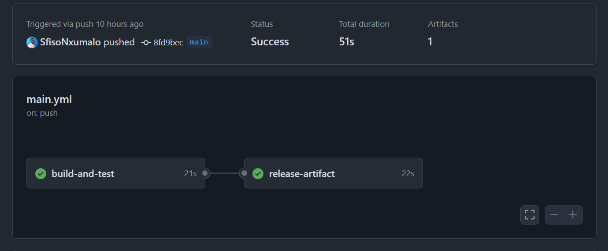
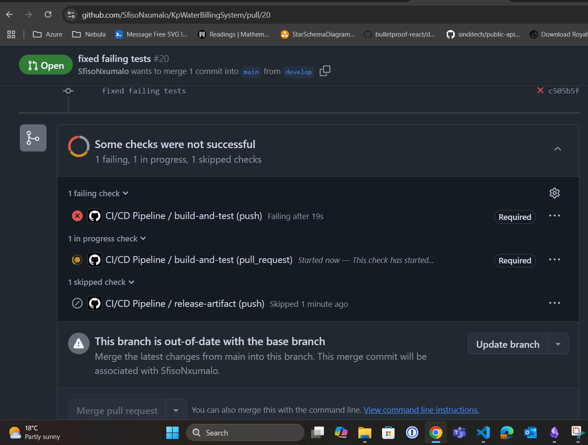

# KP Water Billing System

## Introduction
The **KP Water Billing System** is a digital solution designed to replace the manual, paper-based water meter reading and billing process in our community. Currently, employees record water readings on paper, manually generate bills, and send them to customers. 

## Solution
The **KP Water Billing System** provides a streamlined digital approach:
- Employees enter readings using a **mobile app**.
- A **photo of the meter reading** is captured as proof.
- The system automatically stores the data in a **cloud database**.
- Bills are generated **at the end of the month** and sent to customers via **email**.
- Customers can view their **billing history and usage reports** through a web dashboard.

## Documentation
- **[System Specification](/mds/SPECIFICATION.md)**: Contains a detailed breakdown of the system's scope, feasibility, and requirements.
- **[Architecture Documentation](/mds/ARCHITECTURE.md)**: Includes C4 diagrams and technical system architecture details.
- **[Stake Holder Analysis](/mds/StakeholderAnalysisTable.md)**
- **[System Requirements](/mds/SystemRequirementsDocument.md)**:
- **[Use Case Specifications](/mds/UseCaseSpecifications.md)**
- **[Use Case Diagram](/mds/UseCase.md)**
- **[Test Case](/mds/TestCaseDevelopment.md)**

##### Agile Development
- **[Agile Planning Document](/mds/AgilePlanningDocument.md)**
- **[Sprint Planning](/mds/SprintPlanning.md)**
- **[User Story](/mds/UserStory.md)**
- **[Product Backlog](/mds/backlog.md)**
- **[Reflections](/mds/AgileReflection.md)**

##### Kanban Board Implementation
- **[Template Analysis and selection](/mds/template_analysis.md)**
- **[Custom Kanban Board](/mds/CustomKanbanBoardCreation.md)**
- **[Kanban Board Explanation](/mds/kanban_explanation.md)**
- **[Reflections](/mds/kanban_reflection.md)**

##### Object State Modeling and Activity Workflow Modeling
- **[Object State Modelling](/mds/ObjectStateModelling.md)**
- **[Activity Diagram](/mds/ActivityDiagram.md)**
- **[Reflections](/mds/ObjectModellingReflection.md)**


# KP Water Billing System
- **[KP Water Billing System App](/mds/KPWaterBillingSystemAPP.md)**

### Repository Pattern

For the KP Water Billing System, I chose Dependency Injection (DI) over the Factory pattern to keep the system flexible and easier to maintain. With DI, I can easily swap out different repository implementations (like InMemoryDB or SqlDb) without affecting the rest of the code. This helps in adapting to different storage solutions without changing the core logic. I also used generics in the repositories to avoid repeating code for different entity types (like Employee and Customer). This approach keeps things cleaner, ensures type safety, and makes it easier to manage and scale the system as it grows.

- **[Repository Pattern implementation](App/KpWaterBillingSystem/KpWaterBillingSystem/src/Repository/)**

## Getting Started

1. Clone the project
2. Run `dotnet restore`
3. Build the solution with `dotnet build`
4. Run tests using `dotnet test`

## 🛠️ Features for Contribution


| Feature                        | Status | Type            |
|-------------------------------|--------|-----------------|
| Redis Caching                 | ⏳      | Feature Request |
| Logging                       | ⏳      | Feature Request |
| CI/CD with GitHub Actions     | ✅      | Enhancement     |
| Add Customer Unit Tests       | ⏳      | Good First Issue |
| Improve Documentation         | ⏳      | Good First Issue |

#### API DOCUMENTATION
- **[KP Water Management API](/mds/APIDocumentation.md)**

- **[Roadmap](/mds/Roadmap.md)**

## Running Tests Locally

To run all unit tests locally using **NUnit**, follow these steps:

1. Make sure you have the .NET SDK installed (recommended: .NET 6 or later).
2. Navigate to the root of the project in your terminal.
3. Run the following command:

```bash
dotnet test
```

This will build the solution and execute all the test cases, including the ones that verify:

* Creational patterns
* Repository logic (in-memory and SQL-based)
* Edge cases (e.g. null entities, duplicate IDs, thread-safety for Singleton)


## CI/CD Pipeline (GitHub Actions)

- **[Protection](mds/Protection.md)**


We use **GitHub Actions** to automate testing and release processes.

### On Every Push/PR

* The workflow runs all unit tests.
* If any test fails, the PR is blocked from being merged.

### On Protected Branch (main)

* Pull requests must be reviewed.
* Tests must pass before merging.
* No one can push directly to main — all changes must go through PRs.


### On Merge to Main

* The pipeline builds the project.
* Generates a release artifact (e.g. ZIP, JAR, or published DLLs).
* Uploads the artifact for download in the GitHub Actions tab.




## Failed PR 


