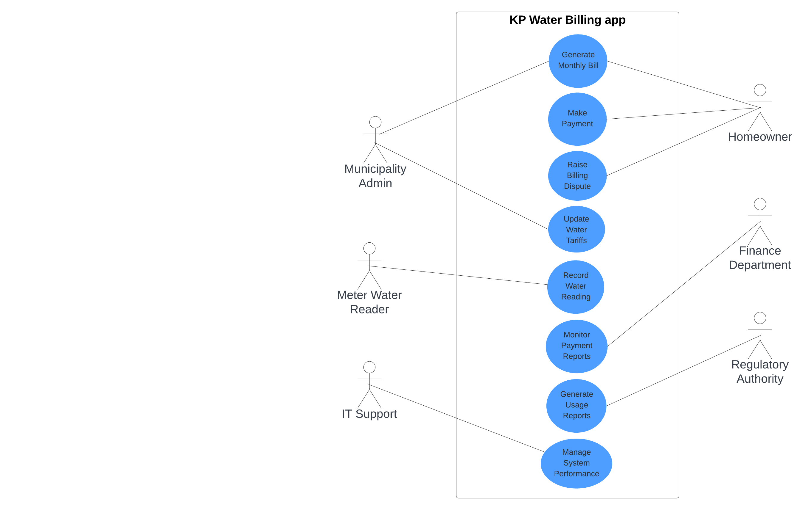

# **4. Use Case Diagram**

#### Use case Diagram made with lucid charts

#### Use case Diagram made with mermaid

## **4.1 Explanation**

### **Key Actors and Their Roles**
1. **Homeowner** – Views bills, makes payments, and raises disputes.
2. **Water Meter Reader** – Records water usage and uploads proof of reading.
3. **Municipality Admin** – Generates bills and manages water tariffs.
4. **Finance Department** – Monitors payments and handles billing issues.
5. **IT Support Team** – Ensures system stability and performance.
6. **Regulatory Authority** – Audits reports for compliance and usage trends.

### **Relationships Between Actors and Use Cases**
- **Generalization:** Homeowners can view, pay, and dispute bills as part of general billing interactions.
- **Inclusion:** Payment and dispute resolution rely on accurate billing and real-time updates.
- **Dependency:** Bill generation depends on accurate water readings and tariff updates.

### **Addressing Stakeholder Concerns**
- **Accuracy and Transparency:** Proof of readings ensures accurate billing.
- **Usability:** Mobile app and portal simplify user interaction.
- **Security:** Data encryption and user authentication protect sensitive information.
- **Performance:** Efficient data processing ensures timely billing and reporting.

